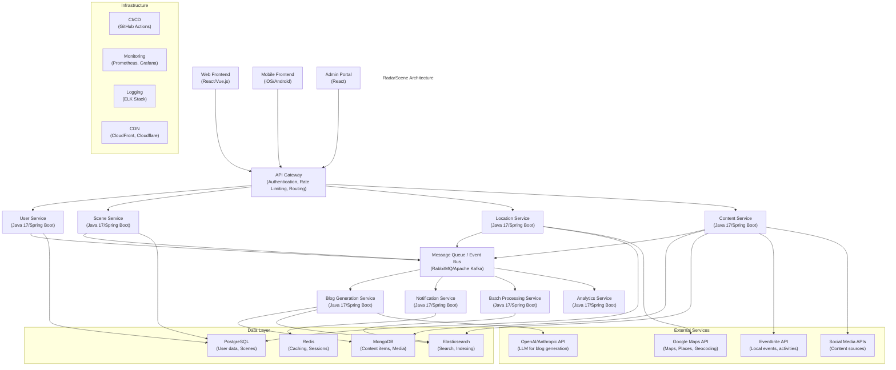
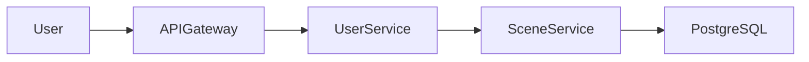
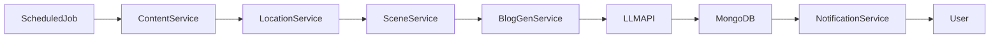
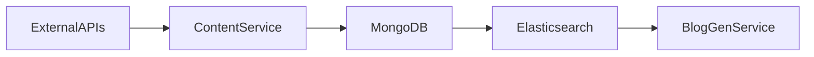
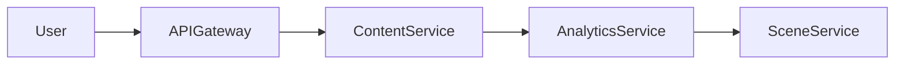

```mermaid
flowchart TD
    %% Client Layer
    WebFrontend["Web Frontend\n(React/Vue.js)"]
    MobileFrontend["Mobile Frontend\n(iOS/Android)"]
    AdminPortal["Admin Portal\n(React)"]
    
    %% API Gateway
    APIGateway["API Gateway\n(Authentication, Rate Limiting, Routing)"]
    
    %% Backend Services
    UserService["User Service\n(Java 17/Spring Boot)"]
    SceneService["Scene Service\n(Java 17/Spring Boot)"]
    LocationService["Location Service\n(Java 17/Spring Boot)"]
    ContentService["Content Service\n(Java 17/Spring Boot)"]
    
    %% Message Queue
    MessageQueue["Message Queue / Event Bus\n(RabbitMQ/Apache Kafka)"]
    
    %% Processing Services
    BlogGenService["Blog Generation Service\n(Java 17/Spring Boot)"]
    NotificationService["Notification Service\n(Java 17/Spring Boot)"]
    BatchProcessingService["Batch Processing Service\n(Java 17/Spring Boot)"]
    AnalyticsService["Analytics Service\n(Java 17/Spring Boot)"]
    
    %% Data Layer
    subgraph DataLayer["Data Layer"]
        PostgreSQL["PostgreSQL\n(User data, Scenes)"]
        MongoDB["MongoDB\n(Content items, Media)"]
        Redis["Redis\n(Caching, Sessions)"]
        Elasticsearch["Elasticsearch\n(Search, Indexing)"]
    end
    
    %% External Services
    subgraph ExternalServices["External Services"]
        LLMAPI["OpenAI/Anthropic API\n(LLM for blog generation)"]
        MapsAPI["Google Maps API\n(Maps, Places, Geocoding)"]
        EventAPI["Eventbrite API\n(Local events, activities)"]
        SocialAPI["Social Media APIs\n(Content sources)"]
    end
    
    %% Infrastructure
    subgraph Infrastructure["Infrastructure"]
        CICD["CI/CD\n(GitHub Actions)"]
        Monitoring["Monitoring\n(Prometheus, Grafana)"]
        Logging["Logging\n(ELK Stack)"]
        CDN["CDN\n(CloudFront, Cloudflare)"]
    end
    
    %% Connections - Client to API Gateway
    WebFrontend --> APIGateway
    MobileFrontend --> APIGateway
    AdminPortal --> APIGateway
    
    %% Connections - API Gateway to Services
    APIGateway --> UserService
    APIGateway --> SceneService
    APIGateway --> LocationService
    APIGateway --> ContentService
    
    %% Connections - Services to Message Queue
    UserService --> MessageQueue
    SceneService --> MessageQueue
    LocationService --> MessageQueue
    ContentService --> MessageQueue
    
    %% Connections - Message Queue to Processing Services
    MessageQueue --> BlogGenService
    MessageQueue --> NotificationService
    MessageQueue --> BatchProcessingService
    MessageQueue --> AnalyticsService
    
    %% Connections - Services to Data Layer
    UserService --> PostgreSQL
    SceneService --> PostgreSQL
    LocationService --> PostgreSQL
    ContentService --> MongoDB
    BlogGenService --> MongoDB
    NotificationService --> Redis
    
    BatchProcessingService --> Elasticsearch
    BlogGenService --> Elasticsearch
    ContentService --> Elasticsearch
    
    %% Connections - Services to External Services
    BlogGenService --> LLMAPI
    LocationService --> MapsAPI
    ContentService --> EventAPI
    ContentService --> SocialAPI
    
    %% Core Flow 1: User Registration & Scene Creation
    classDef coreFlow1 fill:#f9f,stroke:#333,stroke-width:2px
    
    %% Core Flow 2: Daily Blog Generation  
    classDef coreFlow2 fill:#bbf,stroke:#333,stroke-width:2px
    
    %% Core Flow 3: Content Discovery
    classDef coreFlow3 fill:#bfb,stroke:#333,stroke-width:2px
    
    %% Add titles
    title["RadarScene Architecture"]
    style title fill:#fff,stroke:#fff
```

## Core Flows

### 1. User Registration & Scene Creation

```mermaid
flowchart LR
    User --> APIGateway --> UserService --> SceneService --> PostgreSQL
```

### 2. Daily Blog Generation

```mermaid
flowchart LR
    ScheduledJob --> ContentService --> LocationService --> SceneService --> BlogGenService --> LLMAPI --> MongoDB --> NotificationService --> User
```

### 3. Content Discovery

```mermaid
flowchart LR
    ExternalAPIs --> ContentService --> MongoDB --> Elasticsearch --> BlogGenService
```

### 4. User Interaction

```mermaid
flowchart LR
    User --> APIGateway --> ContentService --> AnalyticsService --> SceneService
```
