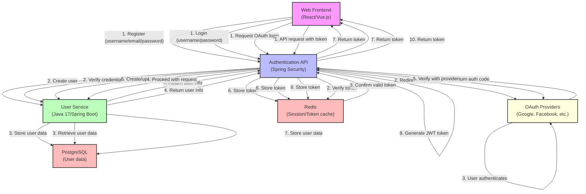
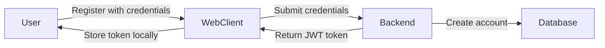
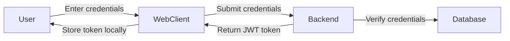
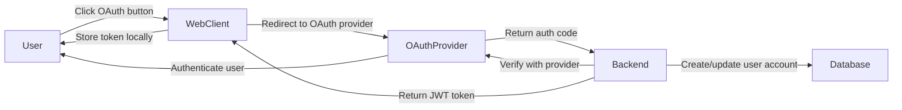
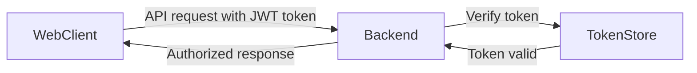

# RadarScene User Authentication Service

```mermaid
flowchart TD
    %% Client Layer
    WebClient["Web Frontend\n(React/Vue.js)"]
    
    %% API Layer
    AuthAPI["Authentication API\n(Spring Security)"]
    
    %% User Service
    UserService["User Service\n(Java 17/Spring Boot)"]
    
    %% Data Sources
    PostgreSQL["PostgreSQL\n(User data)"]
    Redis["Redis\n(Session/Token cache)"]
    
    %% External Authentication (Optional)
    OAuth["OAuth Providers\n(Google, Facebook, etc.)"]
    
    %% Flow - Registration
    WebClient -- "1. Register (username/email/password)" --> AuthAPI
    AuthAPI -- "2. Create user" --> UserService
    UserService -- "3. Store user data" --> PostgreSQL
    UserService -- "4. Return user info" --> AuthAPI
    AuthAPI -- "5. Generate JWT token" --> AuthAPI
    AuthAPI -- "6. Store token" --> Redis
    AuthAPI -- "7. Return token" --> WebClient
    
    %% Flow - Login
    WebClient -- "1. Login (username/password)" --> AuthAPI
    AuthAPI -- "2. Verify credentials" --> UserService
    UserService -- "3. Retrieve user data" --> PostgreSQL
    UserService -- "4. Return user info" --> AuthAPI
    AuthAPI -- "5. Generate JWT token" --> AuthAPI
    AuthAPI -- "6. Store token" --> Redis
    AuthAPI -- "7. Return token" --> WebClient
    
    %% Flow - OAuth Login
    WebClient -- "1. Request OAuth login" --> AuthAPI
    AuthAPI -- "2. Redirect to provider" --> OAuth
    OAuth -- "3. User authenticates" --> OAuth
    OAuth -- "4. Return auth code" --> AuthAPI
    AuthAPI -- "5. Verify with provider" --> OAuth
    AuthAPI -- "6. Create/update user" --> UserService
    UserService -- "7. Store user data" --> PostgreSQL
    AuthAPI -- "8. Generate JWT token" --> AuthAPI
    AuthAPI -- "9. Store token" --> Redis
    AuthAPI -- "10. Return token" --> WebClient
    
    %% Flow - Verify Token
    WebClient -- "1. API request with token" --> AuthAPI
    AuthAPI -- "2. Verify token" --> Redis
    Redis -- "3. Confirm valid token" --> AuthAPI
    AuthAPI -- "4. Proceed with request" --> UserService
    
    classDef clientNode fill:#f9f,stroke:#333,stroke-width:2px;
    classDef apiNode fill:#bbf,stroke:#333,stroke-width:2px;
    classDef serviceNode fill:#bfb,stroke:#333,stroke-width:2px;
    classDef dataNode fill:#fbb,stroke:#333,stroke-width:2px;
    classDef externalNode fill:#ffd,stroke:#333,stroke-width:2px;
    
    class WebClient clientNode;
    class AuthAPI apiNode;
    class UserService serviceNode;
    class PostgreSQL,Redis dataNode;
    class OAuth externalNode;
```

## User Authentication Flows

### Registration Flow

```mermaid
flowchart LR
    User -- "Register with credentials" --> WebClient -- "Submit credentials" --> Backend -- "Create account" --> Database
    Backend -- "Return JWT token" --> WebClient -- "Store token locally" --> User
```

### Login Flow

```mermaid
flowchart LR
    User -- "Enter credentials" --> WebClient -- "Submit credentials" --> Backend -- "Verify credentials" --> Database
    Backend -- "Return JWT token" --> WebClient -- "Store token locally" --> User
```

### OAuth Flow

```mermaid
flowchart LR
    User -- "Click OAuth button" --> WebClient -- "Redirect to OAuth provider" --> OAuthProvider -- "Authenticate user" --> User
    OAuthProvider -- "Return auth code" --> Backend -- "Verify with provider" --> OAuthProvider
    Backend -- "Create/update user account" --> Database
    Backend -- "Return JWT token" --> WebClient -- "Store token locally" --> User
```

### API Authentication

```mermaid
flowchart LR
    WebClient -- "API request with JWT token" --> Backend -- "Verify token" --> TokenStore -- "Token valid" --> Backend
    Backend -- "Authorized response" --> WebClient
```
