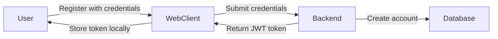
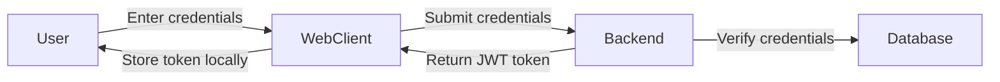
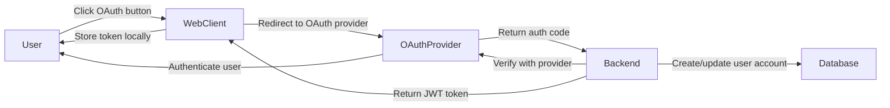
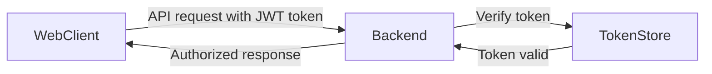

# RadarScene User Authentication Service

## User Authentication Flows

### 1. Registration Flow

```mermaid
flowchart LR
    User -- "Register with credentials" --> WebClient -- "Submit credentials" --> Backend -- "Create account" --> Database
    Backend -- "Return JWT token" --> WebClient -- "Store token locally" --> User
```

### 2. Login Flow

```mermaid
flowchart LR
    User -- "Enter credentials" --> WebClient -- "Submit credentials" --> Backend -- "Verify credentials" --> Database
    Backend -- "Return JWT token" --> WebClient -- "Store token locally" --> User
```

### 3. OAuth Flow

```mermaid
flowchart LR
    User -- "Click OAuth button" --> WebClient -- "Redirect to OAuth provider" --> OAuthProvider -- "Authenticate user" --> User
    OAuthProvider -- "Return auth code" --> Backend -- "Verify with provider" --> OAuthProvider
    Backend -- "Create/update user account" --> Database
    Backend -- "Return JWT token" --> WebClient -- "Store token locally" --> User
```

### 4. API Authentication

```mermaid
flowchart LR
    WebClient -- "API request with JWT token" --> Backend -- "Verify token" --> TokenStore -- "Token valid" --> Backend
    Backend -- "Authorized response" --> WebClient
```
